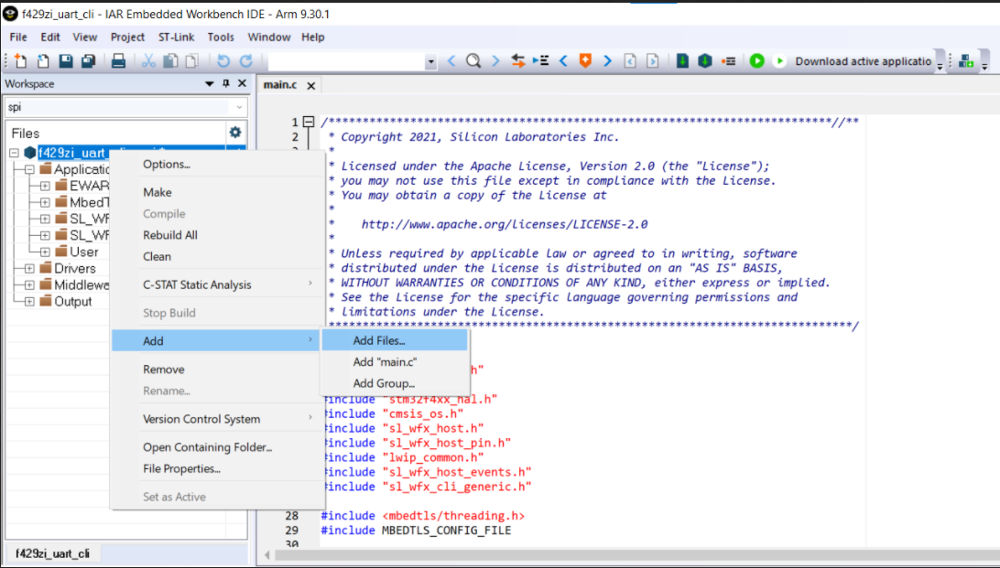
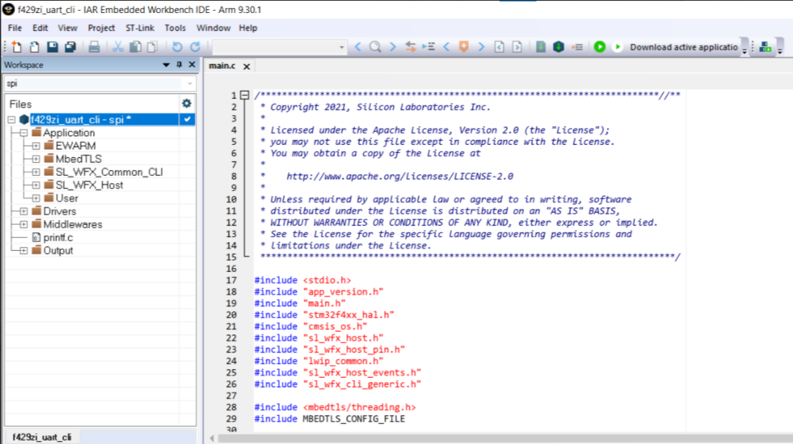

# UART CLI Example

The purpose of this application is to provide a UART Command Line Interface (CLI) to allow interaction with part of the Wi-Fi FMAC driver and the LwIP APIs.

## Requirements

### Hardware Prerequisites

The example requires the hardware components below:

* [**WF200 Wi-Fi® Expansion Kit (SLEXP8022A)**](https://www.silabs.com/products/development-tools/wireless/wi-fi/wf200-expansion-kit) or
  [**WFM200S Wi-Fi® Expansion Kit (SLEXP8023A)**](https://www.silabs.com/products/development-tools/wireless/wi-fi/wfm200-expansion-kit)
* **STMicroelectronics NUCLEO-F429ZI development board**
* An **Arduino/NUCLEO interposer** ([**Available through support ticket request**](https://siliconlabs.force.com/s/contactsupport)) or some flying wires
* A micro USB cable
* A PC to load a binary file on the board, compile the EWARM project or run a serial terminal

### Software Prerequisites

The required software includes:

* The example projects available in this repository
* A Serial terminal to communicate with the board. For example, [**Tera Term**](https://osdn.net/projects/ttssh2/releases/) or [**Putty**](https://www.putty.org/)
* The correct [**ST-link driver**](https://www.st.com/content/st_com/en/products/development-tools/software-development-tools/stm32-software-development-tools/stm32-utilities/stsw-link009.html) installed on your machine
* Optionally, IAR Embedded Workbench IDE (version >= 7.80.2)

## Set up your Kit

Follow the steps described below:

1. Connect the Arduino/Nucleo interposer board to the NUCLEO-F429ZI board.
2. Connect the WF(M)200 expansion kit to the Arduino/Nucleo interposer board.
3. Make sure the "Power" switch on the WF200 expansion kit is in the **[On Board LDO] position**.
4. Select **[SPI] or [SDIO]** on the bus switch depending on the bus you want to use.
5. Connect the NUCLEO board to your PC using the USB cable. The board should appear as a **mass storage device** named "NODE_F429ZI".

## Flash the STM32 MCU

### Use the Binary Files

The first option to run the uart_cli is to use the precompiled binaries provided under **wfx-fullMAC-tools/Examples/STM32/uart_cli/Binaries/**. Depending on the bus selected on the switch, choose the corresponding binary file:
* **f429zi_uart_cli_spi.bin**
* **f429zi_uart_cli_sdio.bin**

To use this method, **drag-and-drop or copy the f429zi_uart_cli_xxx.bin** file to the "NODE_F429ZI" mass storage.

After the STM32 is successfully flashed, you can jump to the **Start the Example** section.

### Compile the Project

Alternatively, use an IDE to compile and flash the project into the NUCLEO board.

1. Open the project with the **EWARM** IDE.
2. Select the bus configuration (**SPI or SDIO**). Make sure it matches the switch position on the WF(M)200 expansion board. If you are using IAR Embedded Workbench version 9.2 or later, please refer to [**Redirect the printf from the IAR default Terminal I/O to the UART**](#redirect-the-printf-from-the-iar-default-terminal-io-to-the-uart).
3. Build the project.
4. Flash the project to the NUCLEO-F429ZI board.

	### **Redirect the printf from the IAR default Terminal I/O to the UART**

	-  If you are using IAR Embedded Workbench version 9.2 or later, the output messages may not display on a serial terminal like **Tera Term** or **Putty** but display on the **Terminal I/O window** of the IAR Embedded Workbench by default when you run the project through the **debug mode**. Read more [**here**](https://www.iar.com/knowledge/support/technical-notes/compiler/migrating-projects-with-the-custom-fputc-function/). 
	- To open the Terminal I/O window when you are in debug mode, on the menu bar, go to **View -> Terminal I/O**.
	- If you want to **redirect printf from the default Terminal I/O to UART** to display the output messages on a serial terminal like **Tera Term** or **Putty**, you need to override the **default function __write** of IAR Embedded Workbench.
	- One way to do that is using our customized **printf.c file**. You can find the source code in the [***Examples\STM32\shared\Middlewares\Third_Party\printf***](../../STM32/shared/Middlewares/Third_Party/printf/) directory. Once you have the source code, you only need to add the file into your project. Refer to the following link for more [**details**](https://www.iar.com/knowledge/learn/programming/overriding-and-redirecting-library-modules-without-rebuilding-the-entire-library/)

	<p align="center">
	
	</p>

	- If the **printf.c file** is added to your project successfully as shown in the image below, you can redo step 3 and 4.
	<p align="center">
	
	</p>

After the STM32 is successfully flashed, jump to the **Start the Example** section.

## Start the Example

1. If using Windows, open the Device Manager to see the COM Port Number assigned to the USB device [STMicroelectronics STLink Virtual COM Port].
2. **Open a Serial Terminal** application, such as PuTTY, configure it to the COM Port Number you found in the previous step, and set the UART settings to **115200 bps, 8 data bits, 1 stop bit and no parity**.
3. Reset the NUCLEO board using the **black button**. You should see the following output.

		Type "help" to view a list of registered commands.
		@

4. The uart_cli project is ready to receive commands. You can start by the 'help' command to list available commands.
	The 'help' list below is provided as an indication. To access an up-to-date list, use the 'help' command on the target.

		help                     : Lists all the registered commands
		cpu-reset                : Reset the host CPU
		cli-version              : Provide the version of the registered modules
		get                      : Get a parameter value
								Usage: get <param_name>
		set                      : Set a parameter value
								Usage: set <param_name> <param_value>
		wifi-reboot              : Reboot the Wi-Fi chip
		network-up               : Connect to the Wi-Fi access point with the information stored in wlan parameters
		nup                      : Alias of network-up
		network-down             : Disconnect from the Wi-Fi access point
		ndo                      : Alias of network-down
		scan                     : Perform a Wi-Fi scan
		wlan-pm                  : Enable/disable the Power Mode on the WLAN interface of the Wi-Fi chip
								NOTE: WLAN must be up
								Usage: wlan-pm <mode> [interval]
									mode: 0(awake), 1(wake-up on beacons), 2(wake-up on DTIMs)
									interval: number of beacons/DTIMs to skip while asleep
		wlan-ps                  : Enable/disable the Power Save on the WLAN interface of the Wi-Fi chip
								Usage: wlan-ps <state>
									state: 0(OFF), 1(ON)
		wlan-rssi                : Get the RSSI of the WLAN interface
		softap-up                : Start the SoftAP interface using the information stored in softap parameters
		sup                      : Alias of softap-up
		softap-down              : Stop the SoftAP interface
		sdo                      : Alias of softap-down
		softap-rssi              : Get the RSSI of a station connected to the SoftAP
								Usage: softap-rssi <sta_mac>
		softap-client-list       : Get the list of clients connected to the SoftAP
		iperf                    : Start a TCP iPerf test as a client or a server
								Usage: iperf <-c ip [-t dur] [-p port] [-k] | -s>
									ip: iPerf server address to connect to (IPv4 format)
									dur: test duration in client mode (default 10s)
									port: server port to connect to (default 5001)
									-k: execute the command in foreground
		iperf-server-stop        : Stop the running iPerf server
		iperf-client-stop        : Stop the running iPerf client
		ip-stats                 : Display the IP stack statistics
		ping                     : Send ICMP ECHO_REQUEST to network hosts
								Usage: ping [-n nb] <ip>
									ip: address to ping (IPv4 format)
									nb: number of requests to send (default 3)
		wfx_test_agent           : Send a command to the RF Test Agent
								Usage: wfx_test_agent <cmd> [cmd_args]


Additionally, you can display the specific command help by tipping:

```
@ [command] help
```