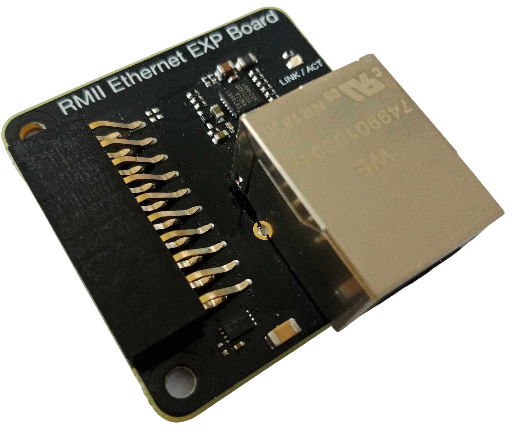

# Ethernet Wifi Bridge Example on WGM160P (BRD4321A)
The Network Bridge feature allows data streaming between **Ethernet** and **Softap** interfaces.
This allows streaming between an Ethernet connection and the device Soft Access Point. 
* Inbound Ethernet packets become outbound Wi-Fi packets on the softAP interface. 
* Input Wi-Fi packets on the softAP interface become outbound Ethernet packets on the Ethernet interface.

The network stack is disabled in Network Bridge mode. Only the device softAP appears on the network. The device does not have an IP address and is not be able to receive or initiate network traffic.
A Wi-Fi SoftAP interface is also provided by the device allowing to connect.

## Requirements

### Hardware Prerequisites

One of the supported platforms listed below is required to run the example:

* [**WGM160P Wi-Fi Module Starter Kit**](https://www.silabs.com/products/development-tools/wireless/wi-fi/wgm160p-wifi-module-starter-kit)

  
  

* [**BRD8026A - RMII Ethernet expansion board**](https://www.silabs.com/documents/public/schematic-files/BRD8026A-A01-schematic.pdf) (Provided with the starter Kit).

  

Additionally, this example requires:

* A PC to configure the board, load a binary file on the board, compile the Simplicity Studio project
* A smartphone to connect to SoftAP interface

### Software Prerequisites

* The required software includes Simplicity Studio 4 and the Gecko SDK Suite (32-bit MCU SDK v5.9, Gecko Platform SDK v2.7 and Micrium OS Kernel SDK v5.8)
* The Wi-Fi Full MAC driver available in [**GitHub**](https://github.com/SiliconLabs/wfx-fullMAC-driver)

## Set Up your Kit

1. Connect the WGM160P Module Board to the Silicon Labs Wireless STK baseboard.

2. Ensure that the power selector switch on the Silicon Labs Wireless STK baseboard is in the [AEM] position.

3. Provide power by connecting the [DBG] USB connector on the Silicon Labs Wireless STK baseboard to the PC using the provided USB cable.

4. Connect the RMII Ethernet expansion board to WGM160P. Connect an ethernet cable with internet access to this expansion board

  

**To Install Simplicity Studio and the SDK, Clone the GitHub repository, Import the project, Remove GeckoOS and Transfer the binary file**, please follow the [**demonstration quick start guide**](https://docs.silabs.com/wifi/wf200/content-source/getting-started/silabs/ssv4/wgm160/wifi-commissioning-micriumos/getting-started#install-simplicity-studio-and-the-sdk).

## Start the Example

1. Once the binary file transferred, the example  launches a SoftAP interface named _**silabs_bridge**_
2. Enable Wi-Fi on your smartphone
3. Connect to the Access Point _**silabs_bridge**_ provided by the device, with the password **changeme**.
4. Your smartphone will be assigned an IP from ethernet interface.
5. Now your smartphone can access the Internet normally.