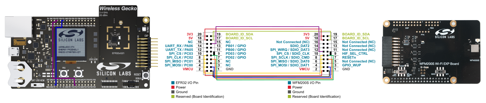

# Set Up a EFR32xG21 Wireless Gecko Starter Kit (SLWSTK6006A) and a WFx Wi-Fi® Expansion Kit

1. Connect the WFx Wi-Fi® Expansion Kit to the EFR32xG21 Wireless Gecko Starter Kit using jump wires as shown below:

    

    Indeed the EFR32xG21 pin mapping on the Expander connector doesn't allow to directly connect the WFx Wi-Fi Expansion Kit to this connector and
    have the example working. This is mostly due to the fact that the pin 12 of the connector is already used on the EFR32xG21 side by the main UART
    although this pin is needed on the WFx side for the SPI WIRQ. To overcome this, jump wires and unused pins are used to reroute the connections.
    Notice the 2 jump wires on the Silicon Labs Wireless Starter Kit baseboard connecting **P0-P31** and **P12-P27**.
    
    **Connection limitations:**
    
    * **Push buttons**: the RESETn and HIF_SEL_CTRL pins of the WFx are connected to the pins 7 and 9 of the expander connector, which are also connected to push buttons
    **PB0** and **PB1** on baseboard sides, prohibiting to use them in the application without perturbing the Wi-Fi connection
    * **LCD**: the SPI pins used to communicate with the WFx are also connected to the LCD screen, prohibiting to use it in the application without perturbing the Wi-Fi connection

2. Make sure the two switches on the WF(M)200 expansion kit are on the correct position:
    * "On Board LDO" for the power switch
    * SPI for the bus switch
3. Connect the Silicon Labs Wireless Starter Kit baseboard to your PC using the USB cable. The board should appear as a device named "JLink CDC UART"
4. Open Putty or the serial terminal chosen and connect to the COM port of the Silicon Labs Wireless Starter Kit baseboard using 115200 bps for the speed
5. Make sure the [**Gecko Bootloader**](../gecko_bootloader/README.md) is downloaded on the device.
As stated in the section **3. Memory Space For Bootloading** of [UG103.6 Bootloader Fundamentals](https://www.silabs.com/documents/public/user-guides/ug103-06-fundamentals-bootloading.pdf),
the bootloader must be downloaded at the address **0x00000000** of the Flash on EFR32xG21 targets.
6. Flash the demo hex file using the Simplicity Studio flash programmer, either the provided hex files can be used or the hex file generated after compilation.
    * The provided hex files can be found in the **binaries** folder of the project
    * To compile the project in Simplicity Studio, import the existing project file to the workspace

    > Make sure the _Flash Erase Options_ in the **Advanced settings...** menu of Simplicity Studio flash programmer is set to **Page Erase**, otherwise the bootloader section
    risks to be erased while flashing the application.

7. Once the binary file transferred, log traces appears on the serial terminal

## Importing the Example Project into Simplicity Studio

1. Clone the GitHub repository to your computer
2. In Simplicity Studio choose **Import...** from the File menu
3. At the bottom of the dialog that appears click **More Import Options...**
4. Under General select **Existing Projects into Workspace**
5. Click **Next** and browse to the location of the cloned repository. Then click **Finish**
