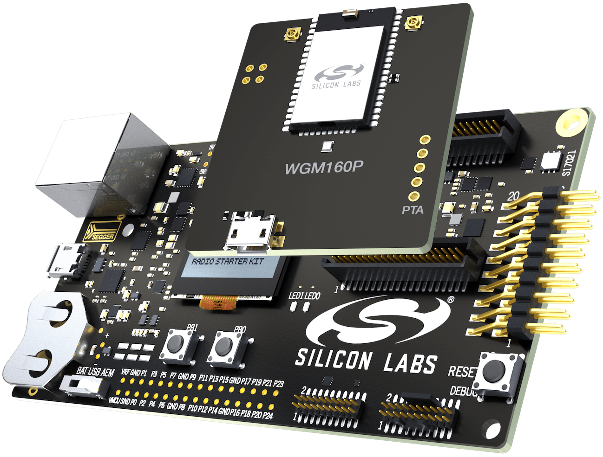
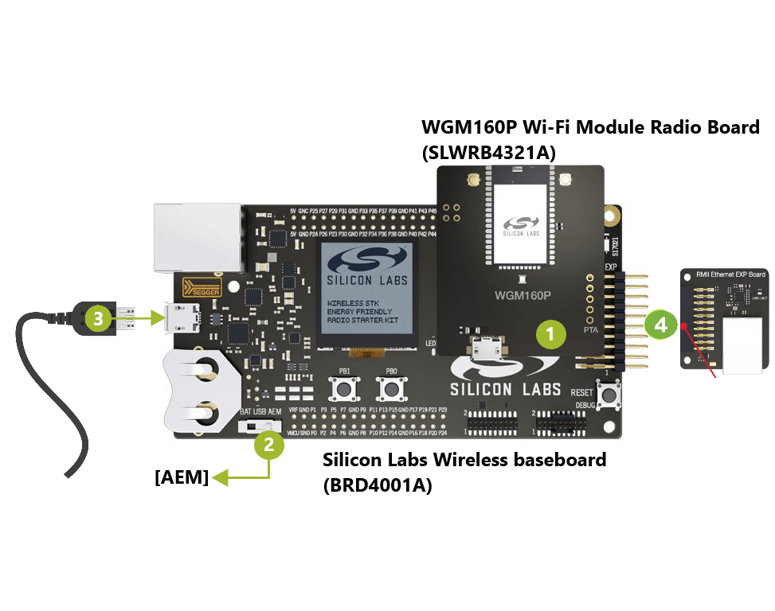

# Ethernet Wifi Bridge Example on WGM160P (BRD4321A)
The Network Bridge feature allows data streaming between **Ethernet** and **Softap** interfaces.
This allows streaming between an Ethernet connection and the device Soft Access Point. 
* Inbound Ethernet packets become outbound Wi-Fi packets on the softAP interface. 
* Input Wi-Fi packets on the softAP interface become outbound Ethernet packets on the Ethernet interface.

The network stack is disabled in Network Bridge mode. Only the device softAP appears on the network. The device does not have an IP address and will not be able to receive or initiate network traffic.
A Wi-Fi SoftAP interface is also provided by the device allowing to connect.

## Requirements

### Hardware Prerequisites

The supported platforms listed below is required to run the example:

* [**WGM160P Wi-Fi Module Starter Kit**](https://www.silabs.com/products/development-tools/wireless/wi-fi/wgm160p-wifi-module-starter-kit)

<p align="center">
  
  
</p>

* [**BRD8026A - RMII Ethernet expansion board**](https://www.silabs.com/documents/public/schematic-files/BRD8026A-A01-schematic.pdf) (Provided with the starter Kit).

<p align="center">
  
</p>


Additionally, this example requires:

* A PC to configure the board, load a binary file on the board, and compile the Simplicity Studio project
* A smartphone to connect to SoftAP interface

### Software Prerequisites

* Simplicity Studio v5 and the Gecko SDK Suite (32-bit MCU SDK v6.0 or newer, Gecko Platform SDK v4.0 or newer, and Micrium OS Kernel SDK v5.10 or newer)
* The example project and the Wi-Fi Full MAC driver (available in the Gecko Platform SDK)
* (Optional) A Serial terminal to communicate with the board. For example, [**Tera Term**](https://osdn.net/projects/ttssh2/releases/) or [**Putty**](https://www.putty.org/)

## Install Simplicity Studio 5 and the Gecko SDK

Simplicity Studio 5 is a free software suite needed to start developing your application. To install Simplicity Studio 5, please follow this [**procedure**](https://docs.silabs.com/simplicity-studio-5-users-guide/latest/ss-5-users-guide-getting-started/install-ss-5-and-software), and install the necessary software packages by selecting the options **[Install by connecting device(s)]** and **[Auto]**.

## Set Up your Kit

1. Connect the WGM160P Module Board to the Silicon Labs Wireless STK baseboard.

2. Ensure that the power selector switch on the Silicon Labs Wireless STK baseboard is in the [AEM] position.

3. Provide power by connecting the [DBG] USB connector on the Silicon Labs Wireless STK baseboard to the PC using the provided USB cable.

4. Connect the RMII Ethernet expansion board to WGM160P. Connect an ethernet cable with internet access to this expansion board

<p align="center">
  
</p>

## Start the Example
> Make sure to follow the procedure of [**importing the projects to Simplicity Studio 5 and creating your desired project**](../README.md)

Once you have created the project **[Platform - Ethernet bridge on Micrium OS kernel]** you can go ahead and continue with the following steps.
1. Compile the example. For more information about how to build and flash a project, refer to the dedicated [**Simplicity Studio 5 documentation**](https://docs.silabs.com/simplicity-studio-5-users-guide/latest/ss-5-users-guide-building-and-flashing/building#debug-build-and-flash).

2. While the toolchain builds the project and launches the debug session, open the Device Manager in Windows OS to see the COM Port Number assigned to the USB device **[J-Link CDC UART Port]**.

3. Open a Serial Terminal application, such as PuTTY, configure it to the COM Port Number you found in the previous step, and set the UART settings to 115200 bps, 8 data bits, 1 stop bit and no parity.

4. After the Debug session is launched, the IDE will switch to the **[Debug]** perspective and will halt the CPU at the main entry point. Press the key **[F8]** to Resume execution.

2. Once the application is running, the example  launches a SoftAP interface named _**silabs_bridge**_
```
Ethernet Bridge Micrium OS Example
AP started
Join the AP with SSID: silabs_bridge
```
3. Enable Wi-Fi on your smartphone.

4. Connect to the Access Point _**silabs_bridge**_ provided by the device, with the password **changeme**.

5. Your smartphone will be assigned an IP from ethernet interface.
```
Ethernet Bridge Micrium OS Example
AP started
Join the AP with SSID: silabs_bridge
Client connected, MAC: XX:XX:XX:XX:XX:XX
```

6. Now your smartphone can access the Internet normally.