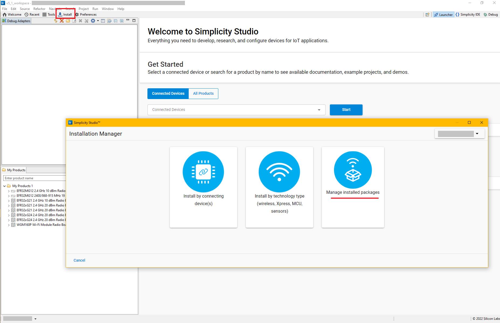

# Multiprotocol Micrium OS Example

The purpose of this application is to provide a Micrium OS example using multiple protocols to toggle LEDs on the development board.

BLE and Wi-Fi protocols are used in this example to communicate with the development kit. Note that, in this application, **neither the Dynamic Multiprotocol feature (DMP) nor a coexistence mechanism are used**.
The BLE interface is used to send advertisements/beacons allowing to connect to the device and toggle the LEDs via the EFR Connect BLE Mobile App.
A Wi-Fi SoftAP interface is also provided by the device. Users can connect and access to a Web Page, through which they will be able to toggle the LEDs on the board.

> **Note:** In this guideline, "_**The development board, kit or device**_" terms will be used interchangeably and referred as a set of an EFR32 SoC radio board (host) + a wireles starter kit mainboard (baseboard) + a WFx Wi-Fi Transceiver (WF200), which provides a working application.

## Requirements

### Hardware Prerequisites

The multiprotocol example is supported by the platforms (EFR32 SoCs + Wireless starter kit mainboard + WF200 series) listed below:

1. [**EFR32xG21 Wireless Gecko Starter Kit (SLWSTK6006A)**](https://www.silabs.com/products/development-tools/wireless/efr32xg21-wireless-starter-kit),
  [**EFR32™ Mighty Gecko Wireless Starter Kit (EFR32MG12 SoCs - SLWSTK6000B)**](https://www.silabs.com/products/development-tools/wireless/mesh-networking/mighty-gecko-starter-kit), or [**EFR32xG24 Radio Board**](https://www.silabs.com/development-tools/wireless/xg24-rb4187c-efr32xg24-wireless-gecko-radio-board)
2. [**WF200 Wi-Fi® Expansion Kit (SLEXP8022A)**](https://www.silabs.com/products/development-tools/wireless/wi-fi/wf200-expansion-kit) or
  [**WFM200S Wi-Fi® Expansion Kit (SLEXP8023A)**](https://www.silabs.com/products/development-tools/wireless/wi-fi/wfm200-expansion-kit)

Additionally, this example requires:

* A PC to create, configure, compile the project on Simplicity Studio IDE and load the binary file to the board. The PC is also used to connect the board through Virtual COM port (UART) to visualize the logs.
* A Smartphone to interact with the BLE interface and access the Web Page

### Software Prerequisites

* The required software includes Simplicity Studio v5 IDE, the Gecko SDK Suite (v4.2.0 or newer) with 32-bit MCU, lwIP stack, Wi-Fi Full-MAC(FMAC) driver (v3.6.0 or newer) and the Bluetooth SDK.
* The example project hosted on [**wfx-fullMAC-tools repository**](https://github.com/SiliconLabs/wfx-fullMAC-tools.git) which can be added to SSv5 IDE as [**the following procedure**](../README.md/#add-the-examples-to-simplicity-studio-5).
* The [**EFR Connect BLE Mobile App**](https://www.silabs.com/developers/efr-connect-mobile-app) available on **Google Play** and **App Store**
* A serial terminal to communicate with the board. For examples, [**Tera Term**](https://osdn.net/projects/ttssh2/releases/), [**Putty**](https://www.putty.org/) or [**MobaXterm**](https://mobaxterm.mobatek.net/)
* A Web browser. E.g: Google Chrome.

##  Main Features and Development Boards' Limitations
The designed main features of the application are:
* The device advertises BLE beacons and accepts one established connection at a time.
* The device starts Wi-Fi SoftAP and initializes a webserver.
* LEDs + Buttons are available. We can control LEDs state either through Buttons, the Webpage or the EFR Connect BLE Mobile App.
* LCD screen on the mainboard (BRD4001) is available for displaying Wi-Fi + BLE + LEDs states.
* VCOM is enabled to show application logs.

Due to the restrictions of HW design, e.g., either EFR32xG21/xG24 SoCs radio board's limited pins or  mainboard's dedicated function pins might be occupied by other modules, and thus EFR32xG21 and EFR32xG24 Wireless Starter Kits can't directly connect to the WF200 module through expansion headers. 

> **Note**: For more details of these limitations, see [**this note**](resources/efr32_wf200_limitation.md).

For the reasons given above, we decided to have two connection modes between the WF200 expansion board and the development board:
* _**Plug-and-play mode:**_ WF200 module **directly connect** to the development board via expansion headers.
  

* _**Jump/Flying-wires mode:**_ WF200 module **can't directly connect** to the main board. Additional jump wires will be used for the connection.

The multiprotocol example can run on EFR32MG12, EF32xG21, EFR32xG24 platforms. Depending on the specific HW connection type listed above, some features could be unavailable/disabled on our kit.

The table below lists available and disabled features for each connection mode, depending on the used platform:

<table>
    <thead>
        <tr>
            <th> Platform </th>
            <th> Supported Connection Type </th>
            <th> Restricted </th>
            <th> Features </th>
        </tr>
    </thead>
    <tbody>
        <tr>
            <td> EFR32MG12 </td>
            <td> Plug-and-Play </td>
            <td> No </td>
            <td> Full features</td>
        </tr>
        <tr>
            <td> EFR32xG21</td>
            <td> Flying-wires only </td>
            <td> Yes </td>
            <td> Wi-Fi + BLE <b>available</b>. LCD screen and Buttons are <b>disabled</b> </td>
        </tr>
        <tr>
            <td rowspan=2> EFR32xG24 </td>
            <td> Plug-and-Play (default) </td>
            <td> Yes </td>
            <td> Wi-Fi + BLE <b>available</b>. LCD screen and VCOM are <b>disabled</b> </td>
        </tr>
        <tr>
            <td> Flying-wires </td>
            <td> No </td>
            <td> Full features </td>
        </tr>
    </tbody>
</table>
 

 

## Install Simplicity Studio 5 and Gecko SDK

Simplicity Studio is the core development environment designed to support the Silicon Labs IoT portfolio of system-on-chips (SoCs) and modules. It provides access to target device-specific web and SDK resources; software and hardware configuration tools; an integrated development environment (IDE) featuring industry-standard code editors, compilers and debuggers; and advanced, value-added tools for network analysis and code-correlated energy profiling. 

To install Simplicity Studio 5, please follow this [**procedure**](https://docs.silabs.com/simplicity-studio-5-users-guide/latest/ss-5-users-guide-getting-started/install-ss-5-and-software) by selecting the options **[Install by connecting device(s)]** and **[Auto]**. For the first time, installing SSv5 IDE always download the latest Gecko SDK version. 

 

In order to update the Gecko SDK, open Simpliticy Studio 5, click on _**Install**_ button to open _**Installation Manager**_ and sign-in with your account, choose _**Manage Installed Packages**_. 

  

Under _**SDKs**_ tab, select the _**Gecko SDK - 32 bit and Wireless MCUs**_ version you aim to update.

  

 

 

## Set Up the Kit and Create Projects on Simplicity Studio 5

Please follow the instructions related to the platform suiting your case:

* [**EFR32MG12 Mighty Gecko Wireless Starter Kit setup**](resources/efr32mg12-wfx-setup.md)
* [**EFR32xG24 Wireless Gecko Pro Kit setup**](resources/efr32xg24-wfx-setup.md) 
  * > **Note:** For plug-and-play default mode, you can skip this guideline and refer to the very similar [**EFR32MG12 setup**](resources/efr32mg12-wfx-setup.md).
* [**EFR32xG21 Wireless Gecko Starter Kit setup**](resources/efr32xg21-wfx-setup.md) 
  * > **Note:** This setup supports flying-wires mode only, with Buttons and LCD screen disabled.

 

## Compiling and Downloading Examples to the Kit
1. After generating the project on SSv5, under **Simplicity IDE** perspective, right click on the project and press **Build**. Make sure the build process is successful.

2. To download the built binary to the board, go to **GNU ARM v10.2.1- Debug** folder, select the **.hex** binary file. Right click to the binary file and select **Flash to Device**

> **Note**: A similar step could be done with one right-click on the project then press **Run As** and select **Silicon Labs ARM Program**

    

## Start the Example

1. Connect the kit to the PC by a VCOM USB cable. Open a serial terminal (e.g., MobaXterm) on PC to see application logs.

2. The example starts sending BLE advertisements/beacons, launches a SoftAP interface named _**multiprotocol_softap**_
and displays the LEDs and the interface connection states on the LCD screen of the board.
    > * **Note**: LCD screen has been disabled for
    >   * EFR32xG21 boards
    >   * EFR32xG24 boards in plug-and-play mode.

3. Enable the Bluetooth on your smartphone

4. Launch the **EFR Connect BLE Mobile App** and start the **Connected Lighting Demo** under the **Demo** view.

5. Select your BLE platform from the list of detected devices, it should be named **MPxxxx** where "**xxxx**" stands for the two last bytes of the BLE MAC address. If several devices are being displayed, the last two bytes of the BLE MAC address composing the BLE name, can be retrieved from the log traces displayed at the boot phase.

6. Your smartphone is now connected to the device using the Bluetooth interface.
Two dots are displayed on each side of the Bluetooth logo on the LCD screen to indicate this state of connection. For instance:

7. On the smartphone screen, touch the light bulb displayed in the mobile app and watch the LEDs toggled on the board.
The LEDs' state is also toggled on the LCD screen and an arrow appears shortly next to the Bluetooth logo to indicate the source of the light toggle. This arrow disappears after a second.

8. Enable the Wi-Fi on your smartphone

9.  Connect to the Access Point _**multiprotocol_softap**_ provided by the device, with a default password **changeme**.

10. Open a Web browser on your smartphone and go to [http://10.10.0.1/](http://10.10.0.1/). If a popup appears due to a lack of Internet connectivity on the Wi-Fi interface make sure to request to stay connected, otherwise the Web page may not be displayed in your browser. 

    

    
    

1.  The displayed Web page not only gives the possibility to toggle the LEDs as the EFR Connect BLE Mobile App but it also allows to:
    * Shutdown an active BLE connection
    * Enable/disable the BLE advertisements
    * Shutdown active connections to the Wi-Fi Softap
    * Disable the Wi-Fi Softap interface
    * Scan and connect to Access Points surrounding the device
    * Display various information about the BLE and Wi-Fi interfaces and their connections
  
2.  LEDs can also be toggled from the push buttons PB0 and PB1 respectively on the board (except for EFR32xG21 devices)

 

This example is actually a combination of two already existing examples, for more information about the EFR Connect BLE Mobile App interactions, please refer to the [DMP Light Demo](https://docs.silabs.com/bluetooth/3.2/miscellaneous/mobile/efr-connect-mobile-app) and for more information about the Web page interactions, please refer to the [Wi-Fi Commissioning Example](https://docs.silabs.com/wifi/wf200/content-source/getting-started/silabs/ssv5/wgm160p/wifi-commissioning-micriumos/interacting-with-the-example).
