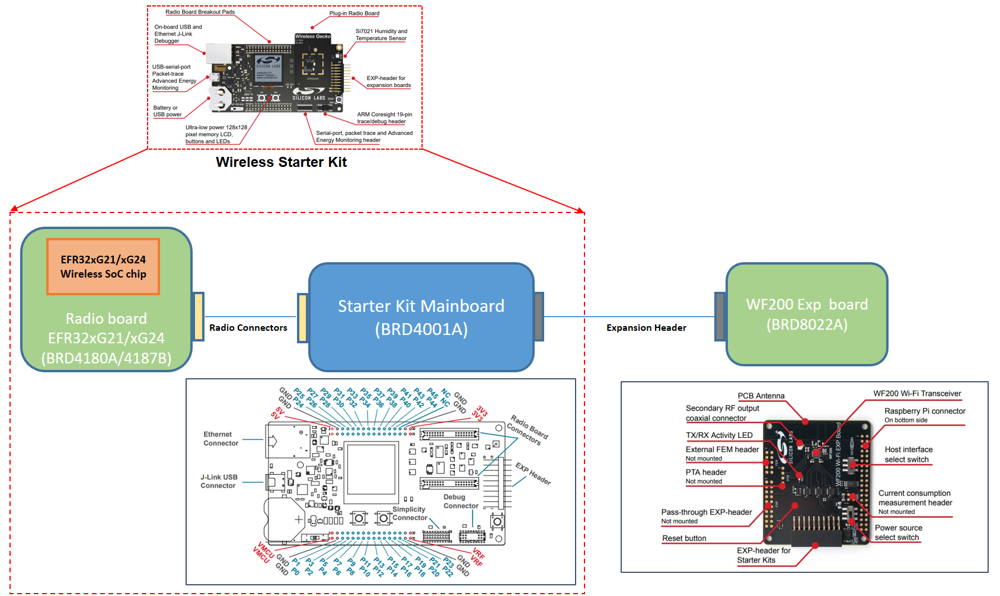
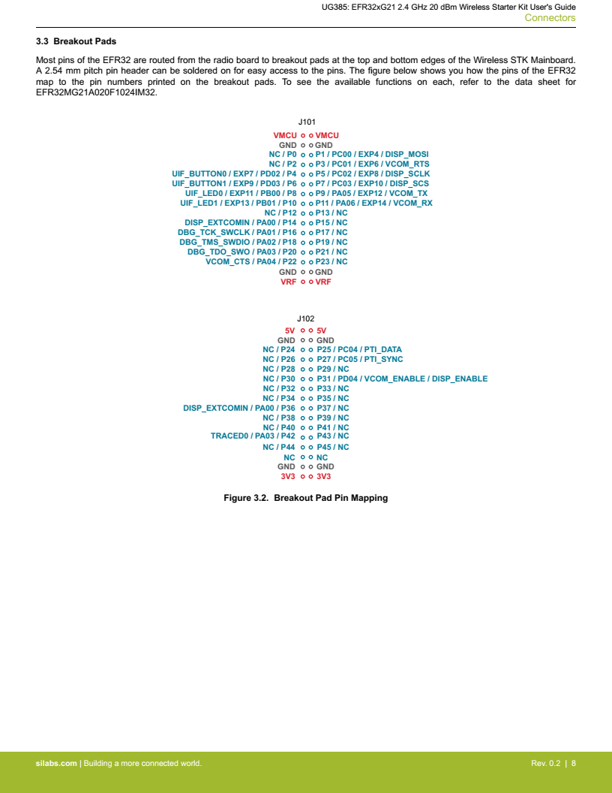
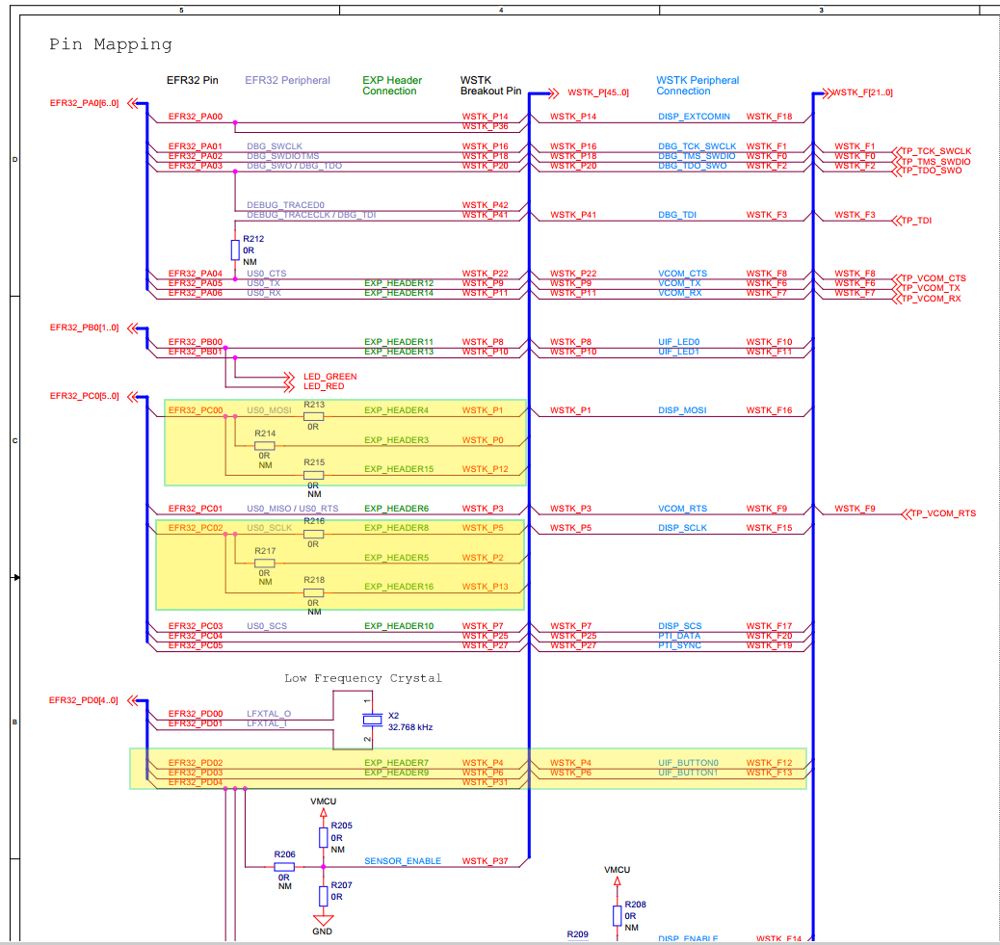
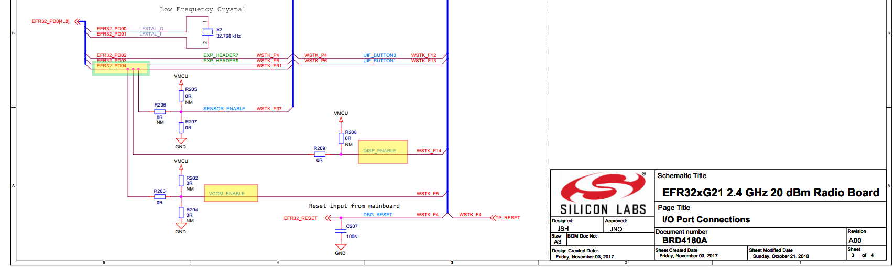
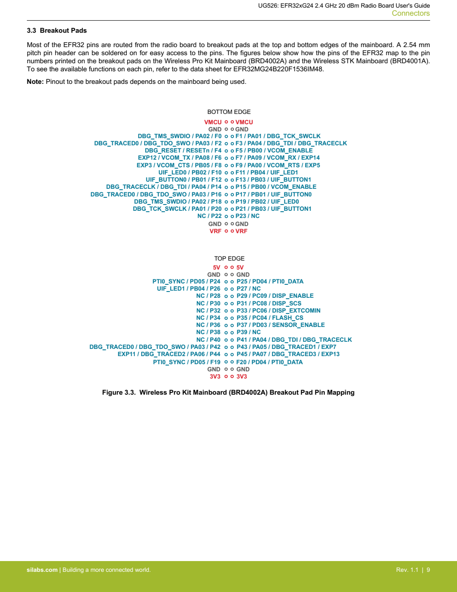
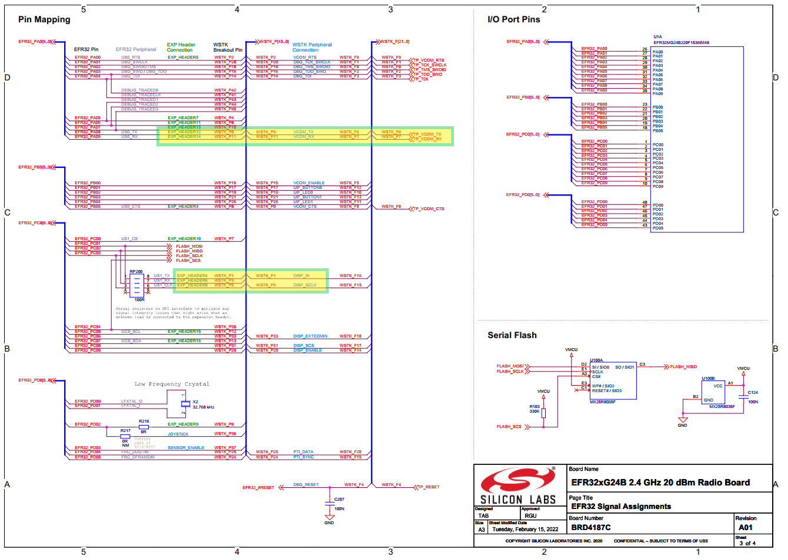
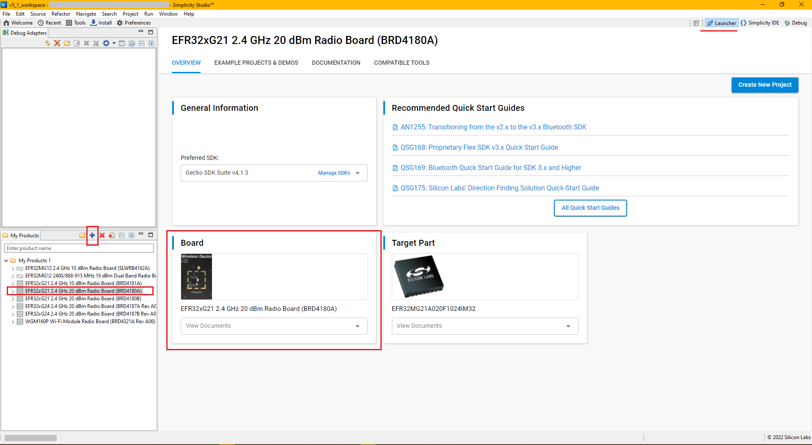
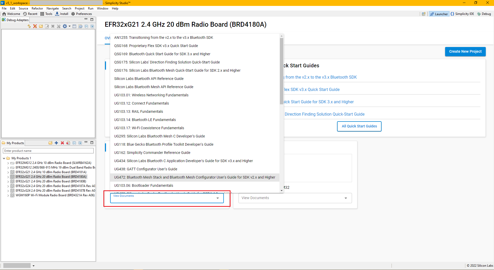

# Restrictions of EFR32™ SoC Wireless Starter Kit

This note explains why EFR32xG21/xG24 Wireless Starter Kits cannot directly connect to the WF200 module for supporting full features of the Multiprotocol example.

## Expected Overall Layout

The picture below presents the expected layout of EFR32 Wireless Starter Kit with WF200 module which is connected through an on-board **expansion header** (plug-and-play mode).

 

> **Note:**  References
>   *   [**SLWSTK6006A: EFR32xG21 Wireless Gecko Starter Kit**](https://www.silabs.com/development-tools/wireless/efr32xg21-wireless-starter-kit?tab=techdocs)
>   *   [**UG526: EFR32xG24 2.4 GHz 20 dBm Radio Board User's Guide**](https://www.silabs.com/documents/public/user-guides/ug526-brd4187c-user-guide.pdf)
>   *   [**UG379: WF200 Wi-Fi Expansion Kit User's Guide**](https://www.silabs.com/documents/public/user-guides/ug379_slexpwfx200-users-guide.pdf)

 

## EFR32xG21 Wireless Gecko Starter Kit Limitation

Considering the [**EFR32xG21 2.4 GHz 20 dBm Wireless Starter Kit User's Guide**](https://www.silabs.com/documents/public/user-guides/ug385-brd4180a-user-guide.pdf) (others have similar specs), _**EFR32xG21 pins are shared with many on-board modules and many pads are not connected (NC)**_ as can be seen in the following image of breakout pad ping mapping.

According to **Pin Mapping** section (page 3) in [**BRD4180A Rev. A00 Schematic PDF file**](https://www.silabs.com/documents/public/schematic-files/BRD4180A-A00-schematic.pdf), the development board _**doesn't support the plug-and-play mode and can't support full features**_ of the _**Multiprotocol example**_ because:

1. EXP_HEADER3, EXP_HEADER4, EXP_HEADER15 are routed to EFR32_PC00 and  EXP_HEADER5, EXP_HEADER8, EXP_HEADER16 are routed to EFR32_PC02. This is the main reason causing EFR32xG21 doesn't have plug-and-play mode.

2. Push buttons must be disabled because UFI_BUTTON0 and UFI_BUTTON1 are also connected to EXP_HEADER7, EXP_HEADER9 respectively. See light yellow boxes in the capture below:
   
    

    
    

3. Either LCD screen or VCOM is disabled because their enable pins share the same GPIO EFR32_PD4 pin
    

    
    

 
 

## EFR32xG24 Wireless Gecko Starter Kit Limitation

The **Connectors** section in [**EFR32xG24 2.4 GHz 20 dBm Radio Board User's Guide**](https://www.silabs.com/documents/public/user-guides/ug526-brd4187c-user-guide.pdf) (others have similar specs) also shows _**EFR32xG24 pins are shared with many on-board modules**_ as the following breakout pad pin mapping image.

According to **Pin Mapping** section (page 3) in [**BRD4187C Rev. A01 Schematic PDF file**](https://www.silabs.com/documents/public/schematic-files/BRD4187C-A01-schematic.pdf), the development board _**can't support full features in the plug-and-play mode**_ because:

1. EXP_HEADER12 and EXP_HEADER14 are connected to VCOM_TX, VCOM_RX, which causes VCOM component must be disabled.

2. LCD screen component is unavailable because EXP_HEADER4 and EXP_HEADER8 are also routed to DISP_SI, DISP_SCLK pins. See light yellow boxes in the capture below:
   
    

    
    

 

## How to retrieve the related documents of a specific board?

Related documents can be downloaded from Simplicity Studio 5. Open **Launcher** tab, press **Add product (Plus sign)** and then enter your development board (e.g., EFR32xG21 radio board with BRD4180A). 

Under **Overview** tab, click on **View Documents** drop box and select desire document

