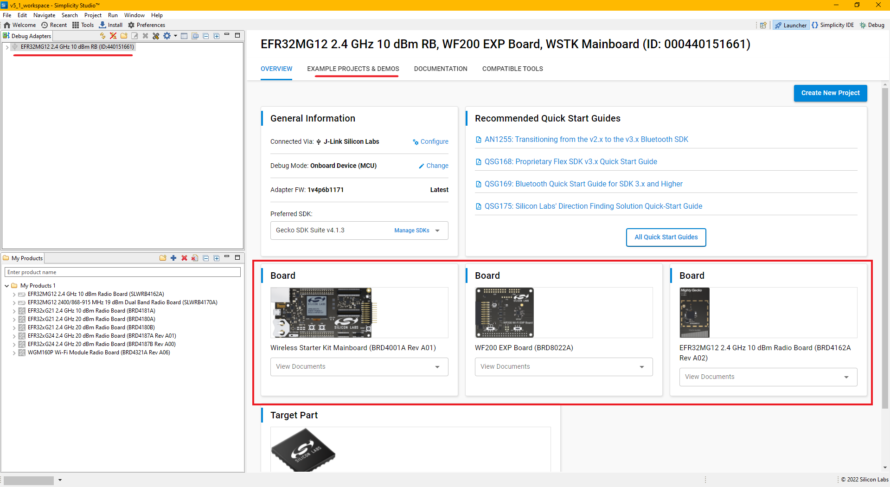
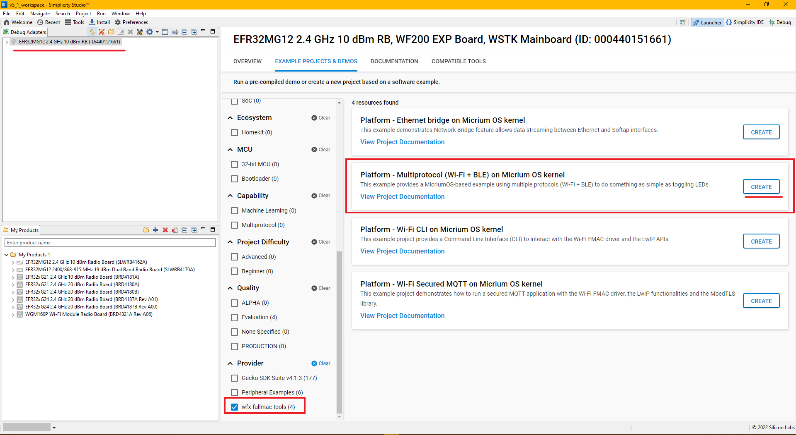

# Set Up Plug-and-Play Connection between an EFR32™ Mighty Gecko Wireless Starter Kit (EFR32MG12 SoCs - SLWSTK6000B) and a WFx Wi-Fi® Expansion Kit

1. Directly connect the WFx Wi-Fi® Expansion Kit (WF200) to the EFR32xG21 Wireless Gecko Starter Kit as shown below:

     connections")     
   
2. Make sure the two switches on the WF(M)200 expansion kit are on the correct position:
    * "On Board LDO" for the power switch
    * SPI for the bus switch
3. Connect the Silicon Labs Wireless Starter Kit baseboard to your PC using the USB cable. The board should appear as a device named "JLink Silicon Labs"
4. Open Putty or the serial terminal chosen and connect to the COM port of the Silicon Labs Wireless Starter Kit baseboard using 115200 bps Baudrate

## Importing the Example Project into Simplicity Studio

1. Open the **Launcher** in Simplicity Studio 5. It should recognize your connected devices under **Debug Adapters** tab. Click on **EXAMPLE PROJECTS & DEMOS** tab.

2. Under **EXAMPLE PROJECTS & DEMOS** tab, scroll down to **Provider** section and check on our examples, select "Multiprotocol MicriumOS" project and the **CREATE** button. The "Project Configuration" dialog should appear. Rename the project if necessary and click on **FINISH**.

