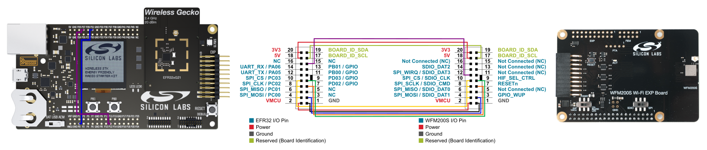
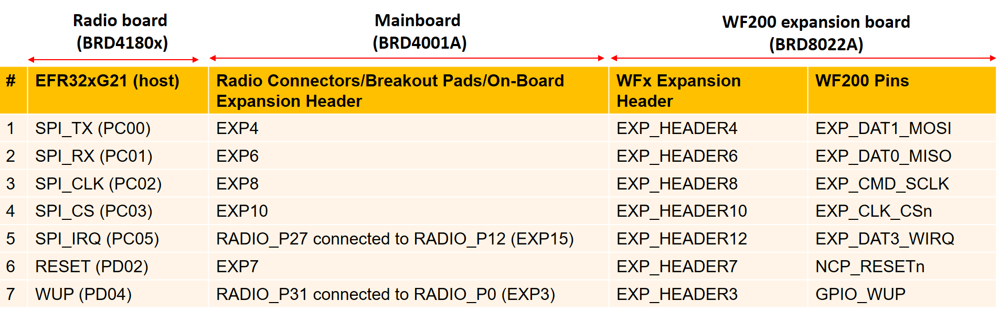
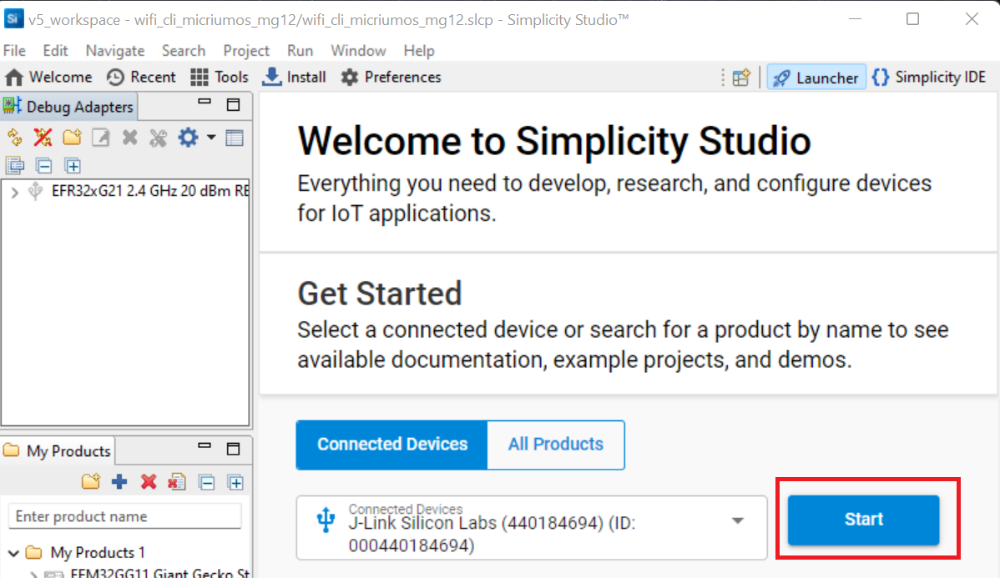
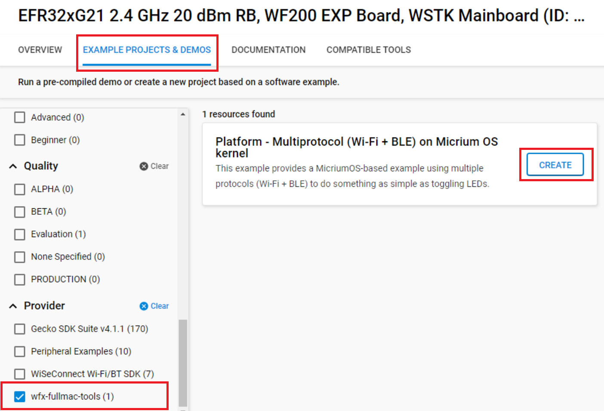

# Set Up Flying-Wires Connection between a EFR32xG21 Wireless Gecko Starter Kit ([**SLWSTK6006A**](https://www.silabs.com/development-tools/wireless/efr32xg21-wireless-starter-kit?tab=techdocs)) and a WFx Wi-Fi® Expansion Kit

1. Connect the WFx Wi-Fi® Expansion Kit to the EFR32xG21 Wireless Gecko Starter Kit using jump wires as shown below:

    

     

    Explicitly, the following table illustrates SPI communication pin mapping between EFRxG21 development kit with WF200 module:

    

    
    

     
    
    > **Note:** For hardware details and limitations, refer to [**this note**](efr32_wf200_limitation.md)

    Indeed the EFR32xG21 pin mapping on the Expander connector doesn't allow to directly connect the WFx Wi-Fi Expansion Kit to this connector and
    have the example working. This is mostly due to the fact that the pin 12 of the connector is already used on the EFR32xG21 side by the main UART
    although this pin is needed on the WFx side for the SPI WIRQ. To overcome this, jump wires and unused pins are used to reroute the connections.
    Notice the 2 jump wires on the Silicon Labs Wireless Starter Kit baseboard connecting **P0-P31** and **P12-P27**.
    
     

    **Connection limitations:**
    
    * **Push buttons**: the RESETn and HIF_SEL_CTRL pins of the WFx are connected to the pins 7 and 9 of the expander connector, which are also connected to push buttons
    **PB0** and **PB1** on baseboard sides, prohibiting to use them in the application without perturbing the Wi-Fi connection
    * **LCD**: the SPI pins used to communicate with the WFx are also connected to the LCD screen, prohibiting to use it in the application without perturbing the Wi-Fi connection.
    
     

2. Make sure the two switches on the WF(M)200 expansion kit are on the correct position:
    * "**On Board LDO**" for the power switch
    * **SPI** for the bus switch
     

3. Connect the Silicon Labs Wireless Starter Kit baseboard to your PC using the USB cable. The board should appear as a device named "JLink Silicon Labs".
    

4. Open Putty or the serial terminal chosen and connect to the COM port of the Silicon Labs Wireless Starter Kit baseboard using 115200 bps Baudrate

## Importing the Example Project into Simplicity Studio

1. Open the **Launcher** in Simplicity Studio 5. It should recognize your connected devices under **Debug Adapters** tab. Click on **Start** button.

2. Choose EXAMPLE PROJECTS & DEMOS, and click on the **CREATE** button. The "Project Configuration" dialog should appear. Rename the project if necessary and click on **FINISH**.

