 # Set Up Flying-Wires Connection between an [**EFR32xG24 Radio Board**](https://www.silabs.com/development-tools/wireless/xg24-rb4187c-efr32xg24-wireless-gecko-radio-board) and a WFx Wi-Fi® Expansion Kit
 ## Hardware setup
> **NOTE**: The guideline is written for EFR32xG24 Radio Boards, which are designed to work with the Wireless Starter Kit Mainboard (BRD4001A). Refer to [**this note**](efr32_wf200_limitation.md) for HW details and restrictions.

 1. Connect the WFx (WF200) Wi-Fi® Expansion Kit to the EFR32xG24 Wireless Gecko Starter Kit using jump/flying wires as the following:
 
    <br>

    <p align="center" style="background-color:White;">
    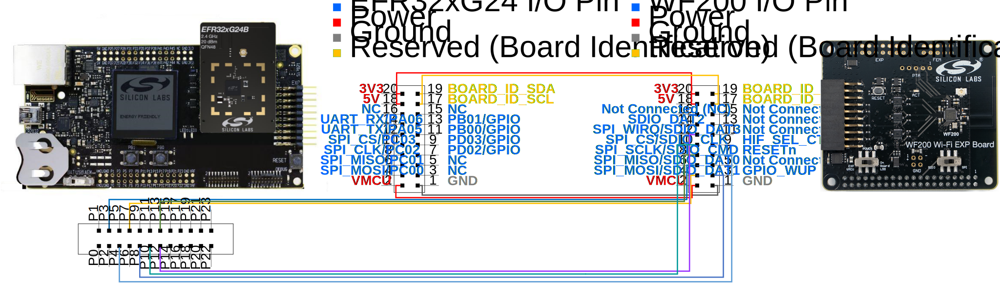
    </p>
    
    
    Specifically, the table below illustrates SPI communication pins mapping between EFR32xG24 kit with WF200 module:

    <p align="center" style="background-color:White;">
    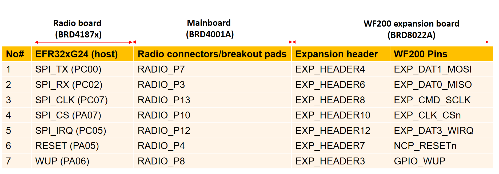
    </p>

    <br>

    Indeed the EFR32xG24 pins mapping on the expansion header connector don't allow to directly connect the WFx Wi-Fi Expansion Kit to this connector and have the multiprotocol example working working with full features (LCD, VCOM, BLE, Wi-fi). This is due to the fact that several pins needed for the SPI communication to the WFx side are dedicatedly used for the LCD and VCOM through the radio connectors and detailed reasons can be found [**here**](efr32_wf200_limitation.md#efr32xg24-wireless-gecko-starter-kit-limitation). 
    
    To overcome this, jump/flying wires and unused pins are used to reroute the connections as in the above figure & table.    

<br>

 2. Make sure two switches on the WF(M)200 expansion board are on the correct positions:

    * "On Board LDO" for the power switch
    * SPI for the bus switch

<br>

3. Connect the Silicon Labs Wireless Pro Kit mainboard to your PC using the USB cable. The board should appear as a device named "JLink Silicon Labs"

<br>

## Quickly checking the hardware connection with our "DEMO" pre-built binary

To quickly test your hardware setup, we provided a "DEMO" binary files placed in _**"patches/brd4187/DEMO_binary"**_ folder that can run on EFR32xG24 boards with flying-wires connection to WF200. This binary provides full features with Wi-Fi SoftAP, BLE, LEDs, Buttons & LCD screen components. You just need to download the binary to the board & run tests as [**this section**](../README.md/#start-the-example).

> **Note**: EFR32xG24 board series are not officially commercialized on the market. So, currently we decided to select and provide the pre-built binary only for BRD4187B. The provided binary is [brd4187b_multiprotocol_micriumos_patched.hex](../patches/brd4187/DEMO_binary/brd4187b_multiprotocol_micriumos_patched.hex).

<br>

In order to download the binary file (**.hex**) to the board:
* Open Simplicity Studio 5, connect your board to PC, board id would be shown up at the **Debug Adapters** tab.
* Click on **Tools** icon & select the **Flash Programmer** under **Tool Dialog**.
<p align="center">
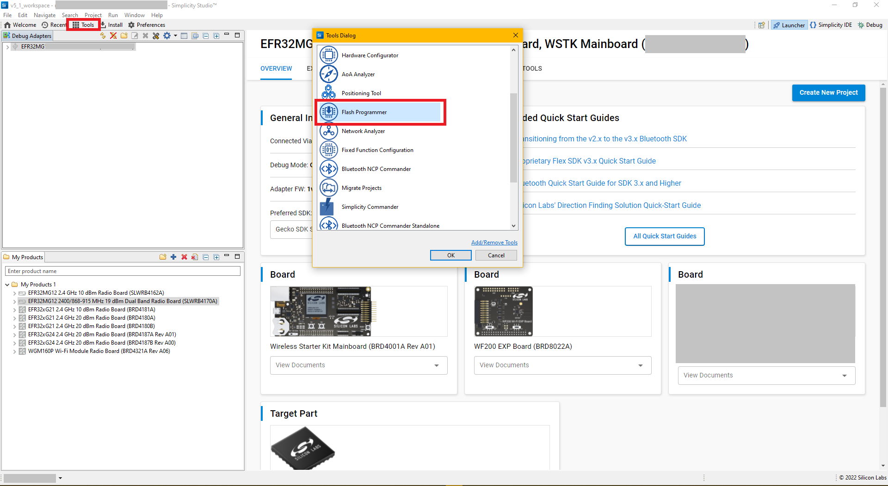
</p>

* Flash your EFR32xG24 board with our pre-built binary by [**this method**](https://docs.silabs.com/simplicity-studio-5-users-guide/latest/ss-5-users-guide-building-and-flashing/flashing#flash-programmer) and browse the "DEMO" binary file in this [**folder**](../patches/brd4187/DEMO_binary/). Similar steps can be found in this [**online document**](https://docs.silabs.com/wifi/wf200/content-source/getting-started/silabs/ssv5/gg11/wifi-commissioning-micriumos/getting-started#start-the-example). For instance:
  <p align="center">
  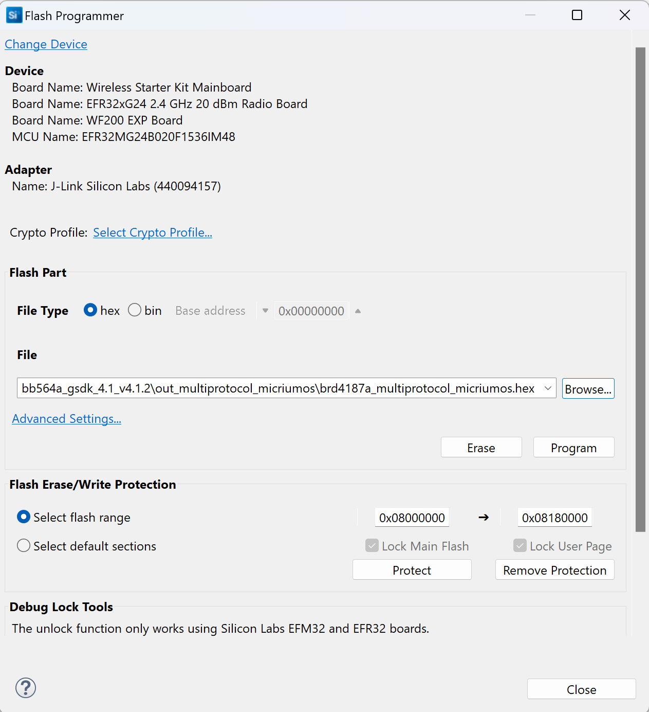
  </p>

A working implementation has been deployed on the kit as below:
   
<p align="center">
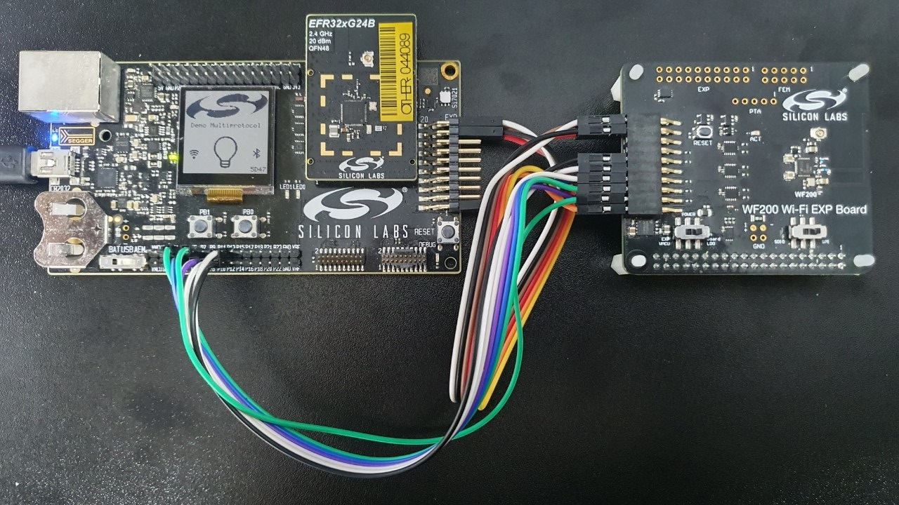
</p>

<br>

## Steps to generate & configure the example with full features on Simplicity Studio 5

> **Important Note:** You must apply the WFX Full MAC driver patch with [**this procedure**](../README.md/#apply-wfx-full-mac-drivers-patch) before doing next steps
### **Step 1: Install _"Early Access Packages"_**

In order to create the projects for EFR32xG24 boards, we need to install the corresponding early access packages. In Simpliticy Studio 5, click on _**Install**_ button to open _**Installation Manager**_ and sign-in with your account, choose _**Manage Installed Packages**_. 

<p align="center">
  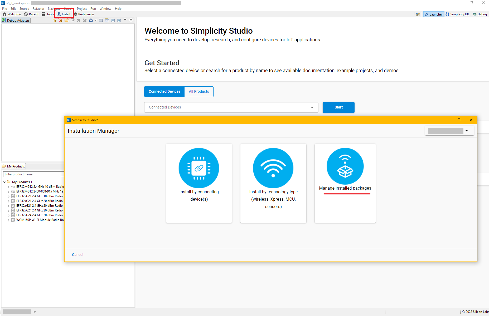
</p>

Under _**Early Access**_ install _**"32-bit and Wireless Products Early Access - 5.0.21"**_.
<p align="center">
  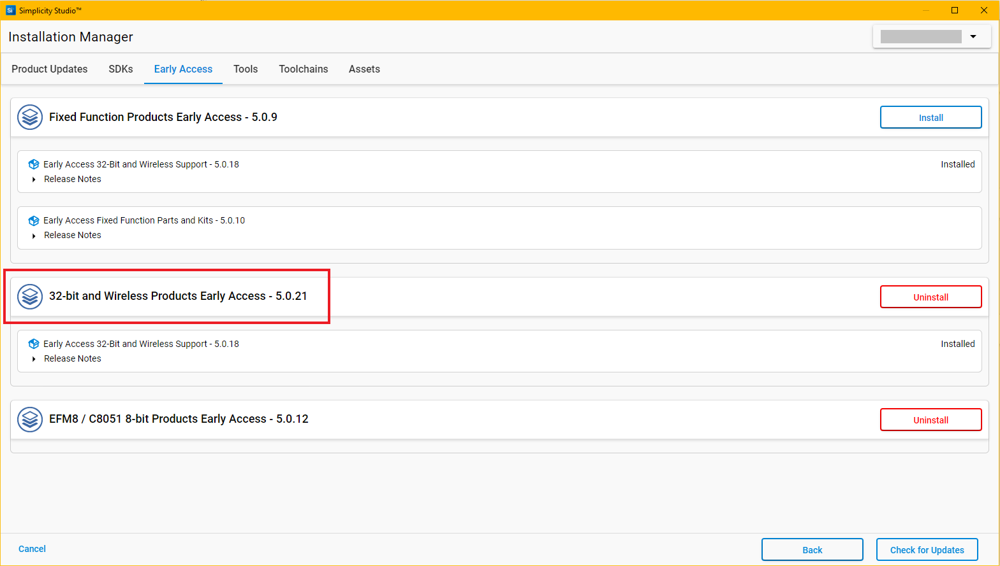
</p>

<br>

### **Step 2: Create & configure the project**
> **Note:** Make sure you added the project [**repository**](https://github.com/SiliconLabs/wfx-fullMAC-tools.git) URL to SSv5 by [**this procedure**](../../README.md#add-the-examples-to-simplicity-studio-5) before going to next steps!
<p align="center">
  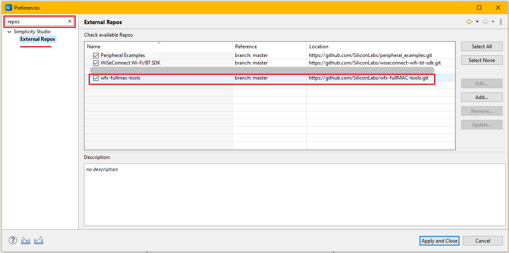
</p>

In order to run the full-featured example, we need to install & change pin configurations of additional components which are disabled by default. Therefore, we provided 02 ways for doing that: 
* Method #1: Applying an example [patch](../patches/brd4187/app.patch) before generating project, then replace the auto-generated configuration header files of the generated project by our prepared files in [this folder](../patches/brd4187/config/).
* Method #2: After importing the project to SSv5, manually install additional components and modify the pins configuration by IDE.
  
While Method #1 is very easy to follow & convenient for quickly getting the project run, Method #2 is a bit more complex & required to do many configuration steps manually. Details are described below.

#### **Method #1: Using an applicaton patch file and prepared header files**
This method is for a quick demonstration, we don't need to manually install components & configure pins setings. 

1. On your PC, go to the cloned project which normally is located at
   
   * On Windows: _**C:\SiliconLabs\SimplicityStudio\v5\developer\repos\wfx-fullMAC-tools**_
   * On Ubuntu: _**~/SimplicityStudio/SimplicityStudio_v5/developer/repos/wfx-fullMAC-tools**_

<br>

2. Open the command terminal (e.g., Git Bash) and run the following command:
    ```
    git apply --whitespace=fix multiprotocol_micriumos/patches/brd4187/app.patch
    ``` 
    For instance: On Windows machine & using Git Bash terminal
<p align="center">
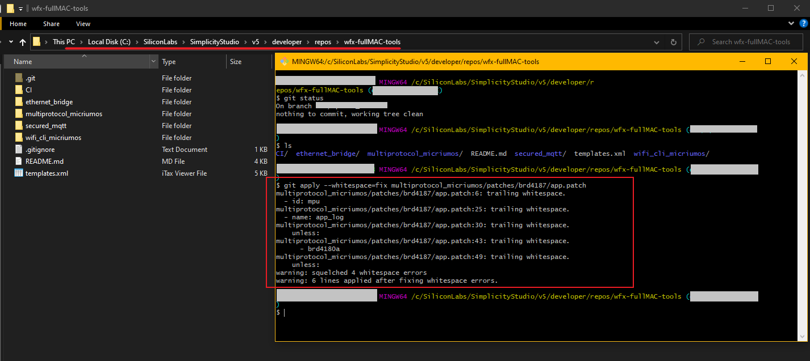
</p>

3. Open the **Launcher** in Simplicity Studio 5. It should recognize your connected devices. Click on **Start** button.

<p align="center">
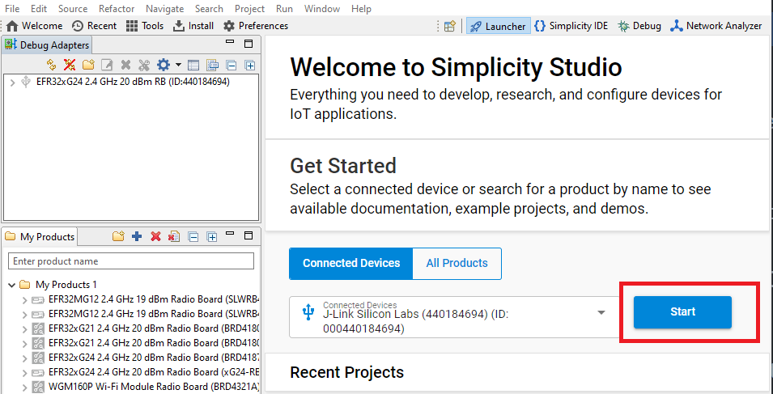
</p>

4. Choose EXAMPLE PROJECTS & DEMOS, and click on the **CREATE** button. The "Project Configuration" dialog should appear. Rename the project if necessary and click on **FINISH**.

<p align="center">
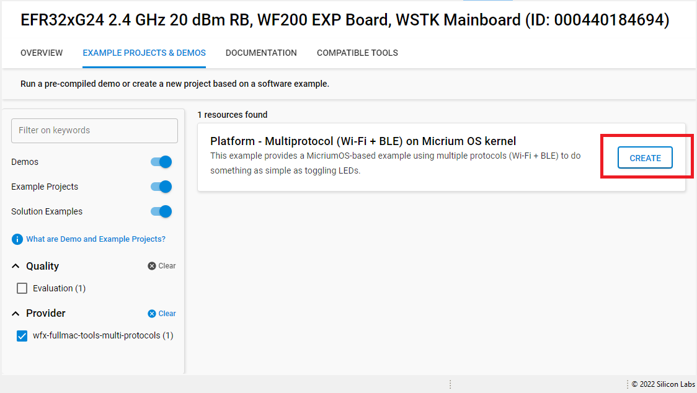
</p>

5. Now navigate to the folder in the cloned project at "**multiprotocol_micriumos/patches/brd4187/config**", and copy 02 prepared config files:
   
    ```
    sl_iostream_eusart_vcom_config.h
    sl_wfx_host_bus_pinout.h
    ```
    and then ***overwrite existing files*** in the **config** folder of the _**newly generated project**_ on SSv5 Workspace:

<p align="center">
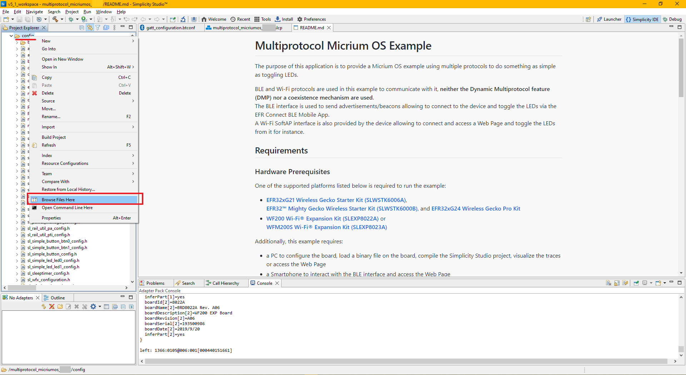
</p>

<p align="center">
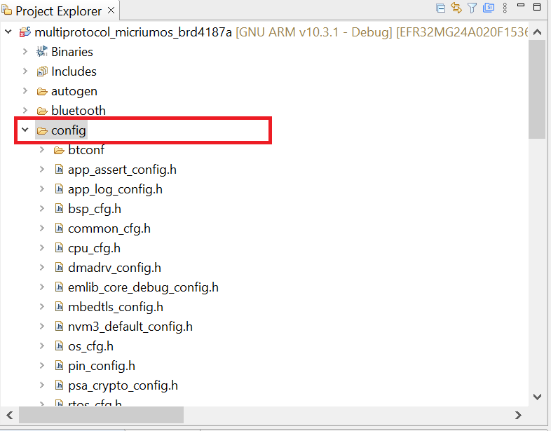
</p>

  > **Important Notes:** Using this method, please
  >   * **Do NOT** open the pintool of SSv5, otherwise Simplicity Studio 5 will automatically modify our prepared configuration header files we have just overwritten.
  >   * If you do open the pintool, then make sure that all the configurations for **SL_IOSTREAM_EUSART_VCOM** is correct as manually done in Step#3 of **[Method 2](#method2)**.

6. Build the patched project & flash the built binary to the board with [**next steps**](../README.md#compiling--downloading-examples-to-the-kit). Run the project on the flying-wires connection mode xG24 board with enabled full features. 

7. Finally, reverse the patched project to the default state by running the following command.

    ```
    git apply --whitespace=fix -R multiprotocol_micriumos/patches/brd4187/app.patch
    ``` 

<br>
<br>

### <a id="method2"></a>**Method #2: Create the project and manually change the pins configuration**
This method requires you to install additional compnents & configure pins manually.
1. Open the Launcher in Simplicity Studio 5. It should recognize your connected devices. Click on **Start** button.

<p align="center">

</p>

2. Choose EXAMPLE PROJECTS & DEMOS, and click on the **CREATE** button. The "Project Configuration" dialog should appear. Rename the project if necessary and click on **FINISH**.
   
<p align="center">

</p>

3. After project creation, open the .slcp file to add components and configure the pinout:
   * Enable Display: Open **SOFTWARE COMPONENTS**, search for **Board Control** and click **Configure**

   <p align="center">
   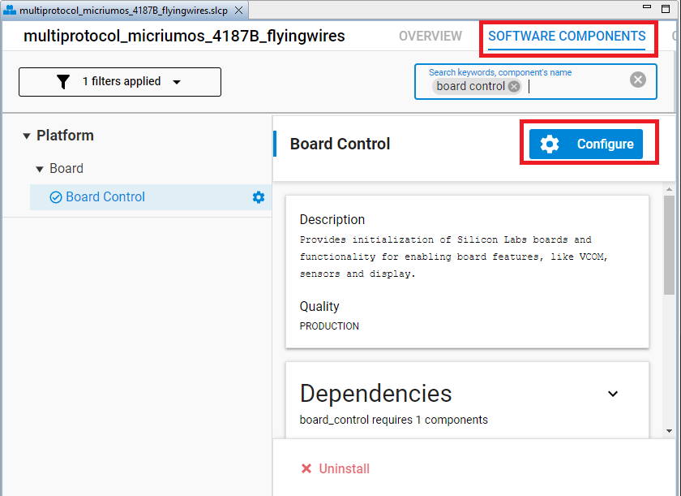
   </p>

   Then, slide the **Enable Display** to the right to activate

   <p align="center">
   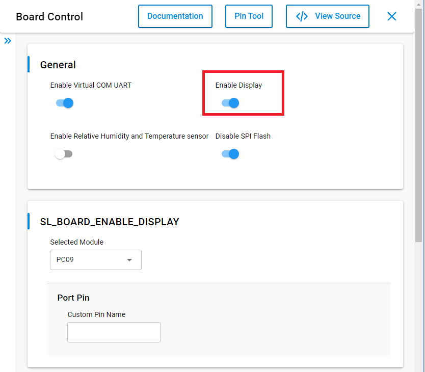
   </p>

   * Enable VCOM: search for the **IO Stream: EUSART** and click **Install**. Enter a name for it, e.g. vcom.

   <p align="center">
   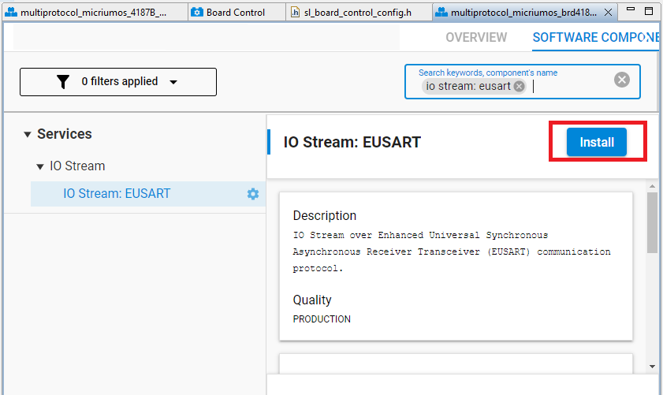
   </p>

   After installing the component, click on **Configure**, scroll down to find section **SL_IOSTREAM_EUSART_VCOM**. Change the config as follows.

   <p align="center">
   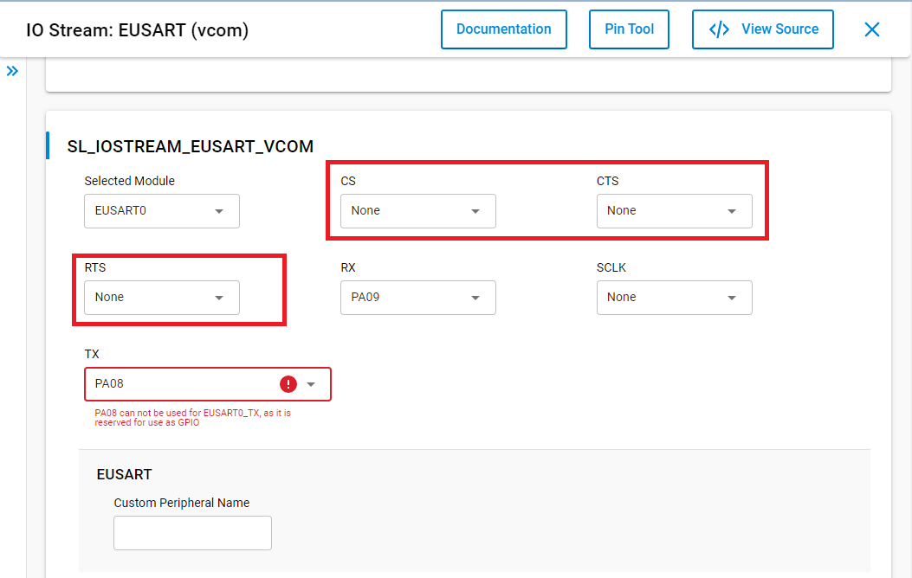
   </p>

   Ignore the warning on TX, upcoming configurations will fix this conflict.
   * Configure WFx Bus SPI: Search for **WFx Bus SPI** component and config the pins under **SL_WFX_HOST_PINOUT_SPI** and **SL_WFX_HOST_PINOUT_SPI_WIRQ**:

   <p align="center">
   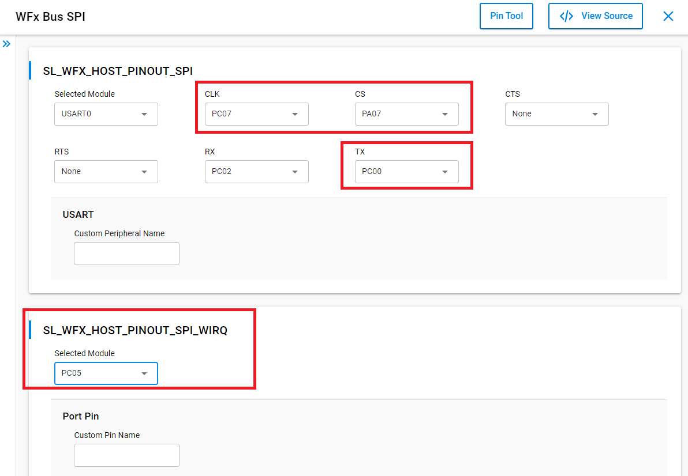
   </p>

   * Configure the WFx FMAC driver: 
     
   <p align="center">
   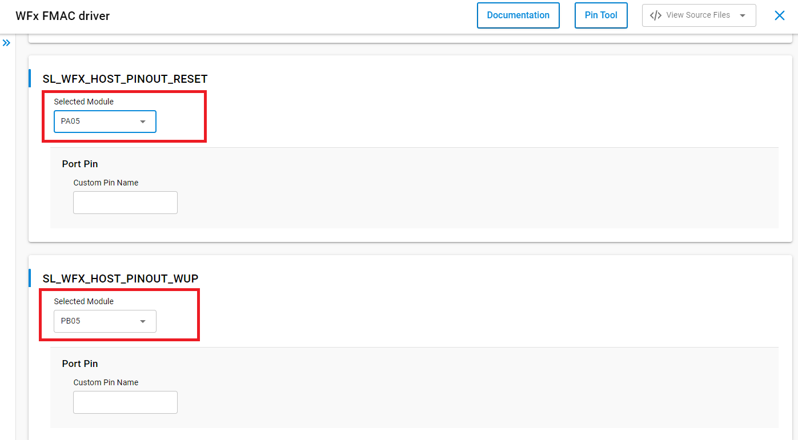
   </p>

   * Install **IO Stream: Retarget STDIO**

   <p align="center">
   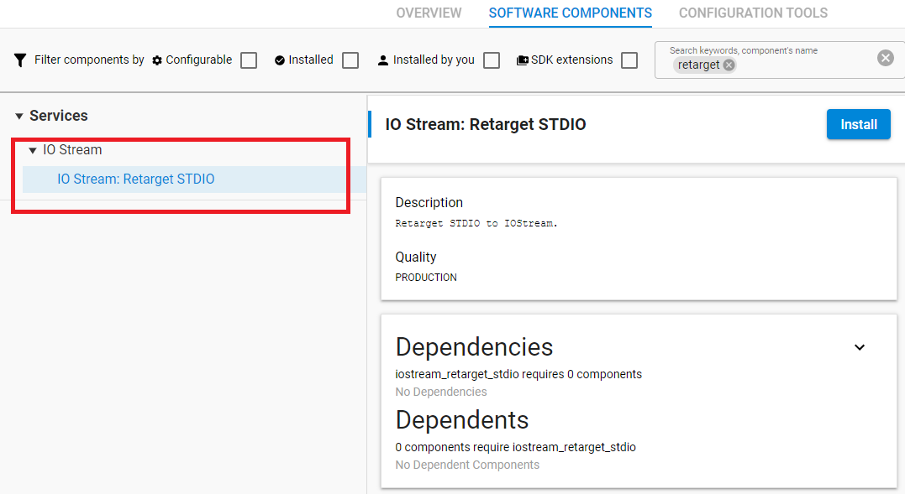
   </p>

   * Install **UI Demo Functions**
     
   <p align="center">
   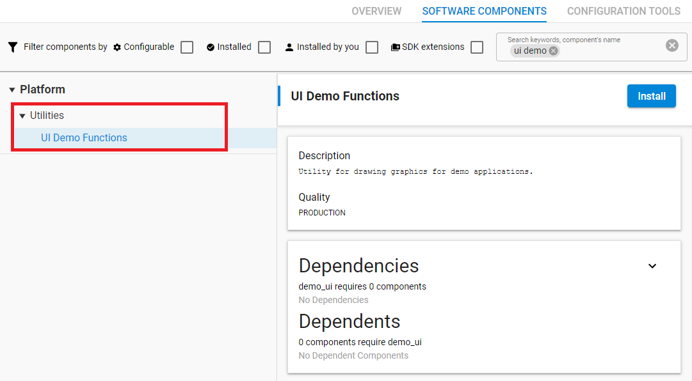
   </p>

4. Build the configured project & flash the built binary to the board with [**next steps**](../README.md#compiling--downloading-examples-to-the-kit). Run the project on the flying-wires connection mode xG24 board with enabled full features. 


