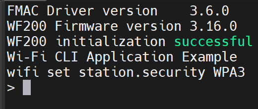
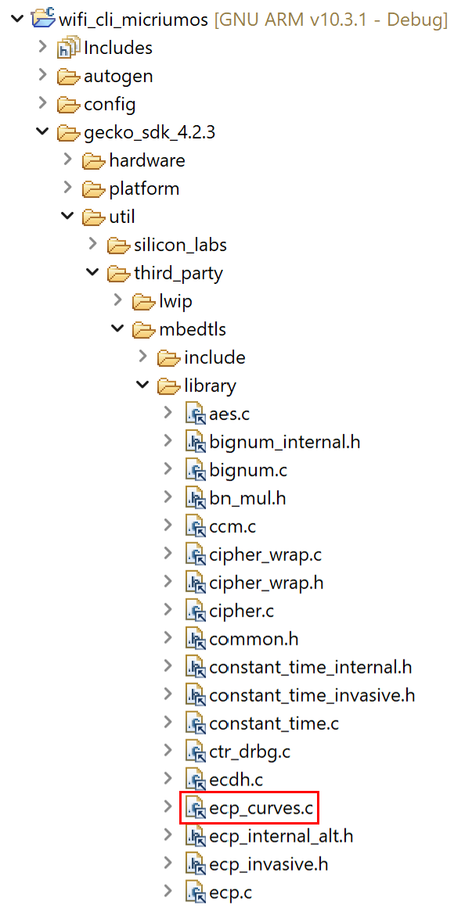
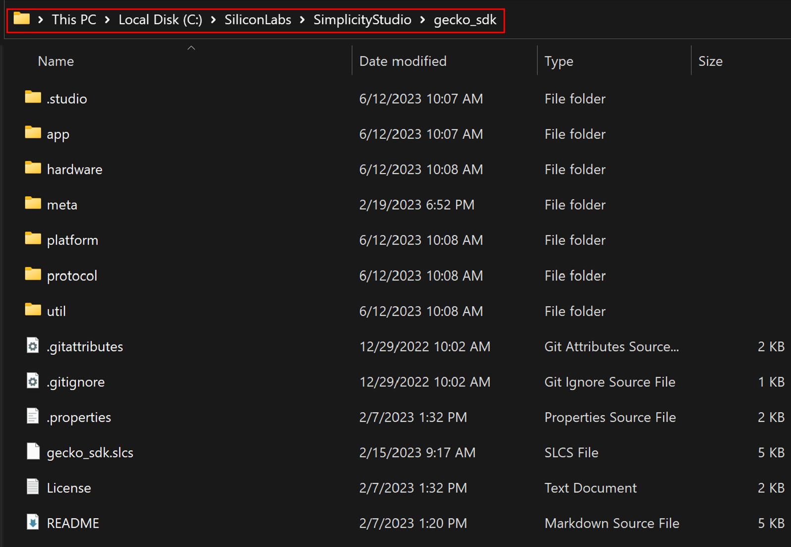
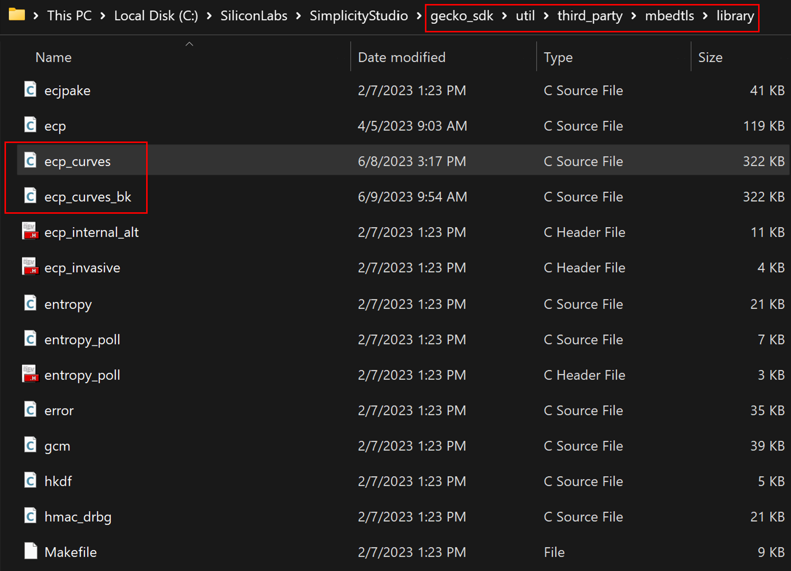

# Using **WPA3** Personal security mode in **Wi-Fi CLI** and **Secured MQTT** examples 

## Applying the modified version of the ***ecp_curves.c*** file in the third-party mbedtls library

In two examples **Wi-Fi CLI** and **Secured MQTT**, through the command line interface (CLI), you can configure to use your device with WPA3 (Wi-Fi Protected Access 3) Personal (also called WPA3 SAE) security mode to connect to an Access Point (AP) that also supports WPA3.

<p align="center">
  
</p>

<center>
Figure 1: Wi-Fi CLI - setting the station security mode as WPA3  
</center>  
<br />

However, to run the project with WPA3, a file named ***ecp_curves.c*** (in the third-party mbedtls library in GSDK) needs to be modified.

<p align="center">
  
</p>

<center>
Figure 2: The ecp_curves.c file of mbedtls in GSDK  
</center>  
<br />

Then, there are **two suggested ways**:
### 1. **Method 1**: Applying a ***patch file*** provided in the wfx-fullMAC-tools repository.

- There is a patch file named ***"wpa3_sae_mode_enable.patch"*** containing the modification that needs to be applied to the ecp_curves.c file stored in your cloned wfx-fullMAC-tools repository at ***"wfx-fullMAC-tools/wpa_supplicant-2.7/wpa3_sae_resources/file_patch"***.
- To apply this file patch, firstly, go to your cloned GSDK, for example in my case:

<p align="center">
  
</p>

<center>
Figure 3: An example of cloned GSDK in the local machine  
</center>  
<br />

- Next, open a terminal (e.g., Git Bash) and run the command to apply the patch file ***"wpa3_sae_mode_enable.patch"*** located on your local machine, for instance:

```
git apply C:/SiliconLabs/SimplicityStudio/v5/developer/repos/wfx-fullMAC-tools/wpa_supplicant-2.7/wpa3_sae_resources/file_patch/wpa3_sae_mode_enable.patch
```

- From now on, you can run Wi-Fi CLI or Secured MQTT applications by configuring your device to use WPA3 security mode.

- **Notice**: if you want to revert the patch, run the following command:

```
git apply -R C:/SiliconLabs/SimplicityStudio/v5/developer/repos/wfx-fullMAC-tools/wpa_supplicant-2.7/wpa3_sae_resources/file_patch/wpa3_sae_mode_enable.patch
```

### 2. **Method 2**: Replacing the default ecp_curves.c file in GSDK with the modified version.

This method is not an optimal way but it's more straightforward.
- Before creating a project, you can keep the **default ecp_curves.c** of the third-party mbedtls as a backup file by renaming it then **copy** the **Silabs customized ecp_curves.c** which is located in your cloned wfx-fullMAC-tools repository at ***"wfx-fullMAC-tools/wpa_supplicant-2.7/wpa3_sae_resources/sl_modif_mbedtls"*** and **paste** at the library of mbedtls ***"gecko_sdk/util/third_party/mbedtls/library"***. Then, the library of mbedtls in your cloned GSDK may look like this: 

<p align="center">
  
</p>

<center>
Figure 4: The mbedtls library after pasting the customized ecp_curves.c  
</center>  
<br />

- Now, you can use WPA3 Personal security mode in your created example application.